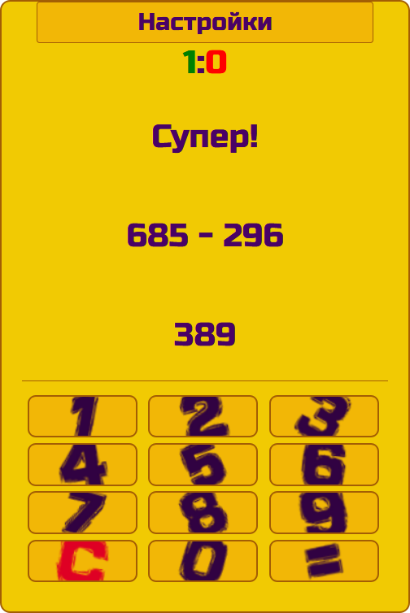
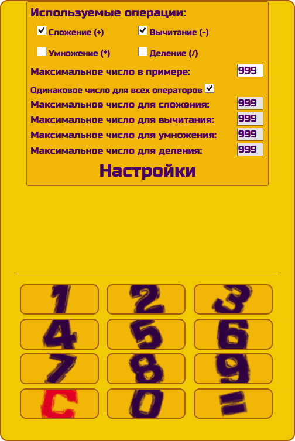

# Reshayka

1. [Описание](#Описание)
2. [Установка](#Установка)
3. [Скриншоты](#Скриншоты)

## <a name="Описание">Описание</a>

Игра на решение математических примеров с большим количеством настроек

- Диапазон возможных чисел: 10 - 999
- Возможноть выбрать необходимые математические операции для тренировки
- Операцию сложения можно убрать только если выбрана хотя бы одна другая
- Возможность указать максимальное число в примере для каждой математической операции

## <a name="Установка">Установка</a>

1. Скачать [архив](distr/reshayka.zip)
2. Разархивировать
3. Открыть в браузере файл `index.html`

## <a name="Скриншоты">Скриншоты</a>

##### Рис.1 Интерфейс

##### Рис.2 Настройки

